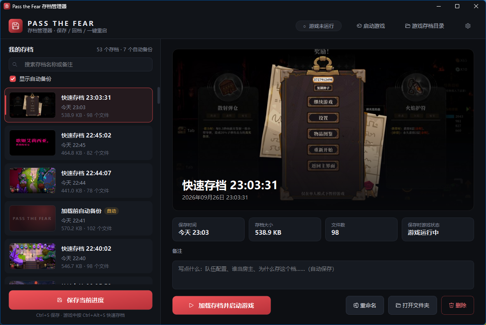

# Pass the Fear 存档管理器

给 **Pass the Fear**（Steam AppID 3561220）用的桌面存档工具。打到满意的位置存一个档，翻车了点一下「加载」，工具会自动关闭游戏、换回存档、重新启动游戏。



## 功能

- **命名存档**：每个存档都可以起名字、写备注，还会自动截一张游戏画面当封面，方便一眼找到想要的存档。
- **一键回档**：选中存档点「加载」，工具会自动关闭游戏、写入存档，再通过 Steam 重新启动游戏。
- **游戏内快速存档**：不用切出游戏，按 `Ctrl+Alt+S` 就能存档，存好后有提示音和系统通知。
- **加载前自动备份**：每次加载之前，先把当前进度备份成一个「自动」存档，点错了也能找回来。
- **存档管理**：支持搜索、重命名、删除和备注，自动备份只保留最近几个，旧的会自动清理。

---

## 一、安装

使用前提：Windows 10 / 11，已通过 Steam 安装 Pass the Fear，并且**至少进过一次游戏**（游戏第一次运行后才会生成存档文件夹）。

### 方式一：安装包（推荐，不需要 Python）

1. 在 [Releases](../../releases) 页面下载 `PassTheFearSaveManager-Setup-版本号.exe`。
2. 双击运行，按提示点「下一步」即可。**不需要管理员权限**，默认装在 `%LOCALAPPDATA%\Programs\PassTheFearSaveManager`。
3. 安装完成后，桌面和开始菜单里会出现「Pass the Fear 存档管理器」。

> Windows 可能会弹出「Windows 已保护你的电脑」：安装包没有数字签名，点「更多信息」→「仍要运行」即可。

**升级**：直接运行新版安装包覆盖安装，存档和设置不会丢失。
**卸载**：在「设置 → 应用」或开始菜单里卸载。卸载时会询问是否删除存档，默认保留。

安装版的存档和设置放在 `%APPDATA%\PassTheFearSaveManager` 里（可以在地址栏输入这个路径直接打开）。

### 方式二：从源码运行

需要 Python 3.10 或更新版本（[下载 Python](https://www.python.org/downloads/)，安装时记得勾选 **Add Python to PATH**）。

在项目文件夹里打开命令行，安装依赖（只需要装一次）：

```bash
pip install -r requirements.txt
```

然后任选一种方式启动：

- **双击 `启动存档管理器.bat`**：不会弹出黑色的命令行窗口。
- 在命令行里运行 `python main.py`：出问题时能直接在命令行看到报错信息。

从源码运行时，存档和设置放在项目文件夹里（`backups\`、`settings.json`）。

程序同一时间只能开一个。如果提示「已在运行」，去任务栏或右下角的系统托盘里找它。

---

## 二、第一次使用

1. 启动存档管理器。它会自动找到游戏的存档目录和游戏程序，一般不需要手动设置。
2. 点右上角的 ⚙ 打开设置，确认两项：
   - **游戏存档目录**：默认是 `%USERPROFILE%\AppData\LocalLow\PlayMudStudio\Pass the fear\GameData`
   - **游戏程序**：如果为空，点「自动查找」
3. **建议先在 Steam 里关闭本游戏的云同步**：在库里右键 Pass the Fear → 属性 → 通用 → 关闭「Steam 云」。这样回档后 Steam 不会用云端存档覆盖掉你换好的存档（详见文末[常见问题](#五常见问题)）。
4. 先存一个档，看它能不能正常加载回来。之后再放心使用。

右上角的状态标签会实时显示游戏是否在运行（「● 游戏运行中」/「○ 游戏未运行」）。

---

## 三、日常使用

### 保存存档

**方法一：在存档管理器里保存**

1. 点左下角的「**保存当前进度**」（或按 `Ctrl+S`）。
2. 输入存档名称。可以直接点下面的快捷标签，比如「第一章」「第二章开始」「Boss 前」「回到大厅」。
3. 需要的话写个备注，比如队伍配置、谁当房主、当前进度。
4. 游戏开着的时候，默认勾选「附带游戏截图作为存档封面」。
5. 点「保存存档」，稍等片刻，新存档就会出现在列表最上面。

**方法二：在游戏里按快捷键（推荐）**

存档管理器开着的时候，在游戏里直接按 **`Ctrl+Alt+S`** 就能存档，不用切出游戏：

- 存档名自动取为「快速存档 时:分:秒」，之后可以再改名。
- 会自动截取当前游戏画面当封面。
- 保存完成后会有提示音和右下角的系统通知。

> 💡 **什么时候存最好？** 游戏在检查点、结算画面或回到大厅时才会把进度写进文件。在这些时间点之后存档，拿到的才是最新进度。战斗中途存档，存下来的可能还是上一个检查点的状态。

### 加载存档（回档）

1. 在左侧列表里点选想回到的存档，右边会显示它的封面和详细信息。
2. 点「**加载存档并重启游戏**」，或者直接**双击**列表里的存档。
3. 确认窗口里会列出接下来要做的每一步，有两个选项：
   - **加载前自动备份当前存档**（推荐一直勾选）
   - **加载完成后自动启动游戏**
4. 点确认后，工具会自动完成：
   1. 关闭正在运行的游戏：先正常关闭，超时后强制结束
   2. 等几秒，让 Steam 完成云同步
   3. 把当前进度备份成一个「自动」存档
   4. 把选中的存档写入游戏存档目录
   5. 通过 Steam 重新启动游戏

整个过程大约 10 秒左右，进入游戏后就是存档时的进度。

### 点错了怎么办？

每次加载之前，工具都会把当时的进度备份成「**加载前自动备份**」，列表里带黄色的「自动」标签。选中它再加载一次，就能回到加载前的状态。

自动备份默认只保留最近 **10 个**，更早的会自动删除（数量可以在设置里改）。重命名不会改变它「自动备份」的身份，照样会被清理。想长期保留，就先加载它，再手动存一个正式存档。

### 管理存档

| 操作 | 方法 |
| --- | --- |
| 搜索 | 左上角搜索框，按名称或备注搜索（`Ctrl+F`） |
| 隐藏自动备份 | 取消勾选「显示自动备份」 |
| 重命名 | 点「重命名」按钮，或按 `F2` |
| 写备注 | 直接在详情页的「备注」框里输入，自动保存 |
| 删除 | 点「删除」按钮，或按 `Delete`（删除后无法恢复） |
| 打开存档文件夹 | 点「打开文件夹」 |
| 更多操作 | 在列表里的存档上点右键 |

顶部栏还有两个按钮：「**启动游戏**」直接启动游戏，「**游戏存档目录**」打开游戏自己的存档文件夹。

### 系统托盘

存档管理器运行时，右下角托盘里有它的图标。右键可以「显示主窗口」「快速存档」「退出」。

注意：**关闭主窗口就会退出程序**，退出后游戏内的快捷键也就不能用了。玩游戏的时候把它最小化就好。

---

## 四、联机时怎么用

Pass the Fear 联机时由**房主**负责保存整队的进度，所以：

- **房主回档**：才能让整队回到之前的进度。建议固定一个人当房主，由这个人来用存档管理器存档和回档。
- **队友回档**：只影响自己的局外进度（解锁、天赋等），没法把房主的房间进度拉回来。

推荐流程：

1. 到了关键节点（比如刚进第二章），让大家先停下来，房主按 `Ctrl+Alt+S` 存档，并在备注里写上队伍情况。
2. 翻车后，房主在存档管理器里加载这个存档，游戏会自动重启。
3. 房主重新开房，队友重新加入。

---

## 五、常见问题

**Steam 弹出「云存档冲突」怎么办？**
选择**本地**存档（Local）。如果选了云端，你刚加载的存档会被云端的覆盖。关闭本游戏的 Steam 云同步可以彻底避免这个问题。

**快捷键没反应 / 提示注册失败？**
快捷键可能被别的程序（输入法、录屏软件等）占用了。在设置里换一个组合，比如 `Ctrl+Alt+F5`。另外，存档管理器必须开着快捷键才有用。

**存档封面是默认的「PASS THE FEAR」图，没有截到游戏画面？**
游戏没在运行、被最小化，或者用的是独占全屏模式时，可能截不到画面。只是没有封面，存档本身完全正常。游戏设成「无边框窗口」模式截图最稳定。

**提示「无法关闭游戏进程」？**
手动退出游戏，再点一次加载。也可以在设置 → 高级里把「关闭游戏时最多等待」调长一些。

**我想用直接运行 exe 的方式启动游戏，不走 Steam？**
设置 → 启动方式 → 选择「直接运行游戏程序」。一般推荐走 Steam，否则游戏可能拿不到 Steam 登录状态。

**程序报错了？**
错误信息会弹窗提示，同时写入程序目录下的 `error.log`，反馈问题时附上这个文件即可。

**能把存档发给队友吗？**
可以把 `backups\` 下对应的存档文件夹复制到对方的 `backups\` 里，对方重新打开存档管理器就能看到。但游戏存档是加密的，里面可能绑定了 Steam 账号，**跨账号能不能正常加载还没有验证过**，建议先在对方电脑上试一下。

---

## 六、设置说明

| 设置项 | 说明 | 默认值 |
| --- | --- | --- |
| 游戏存档目录 | 游戏自己存档的位置 | `...\LocalLow\PlayMudStudio\Pass the fear\GameData` |
| 存档库位置 | 存档管理器存放所有存档的地方 | 安装版：`%APPDATA%\PassTheFearSaveManager\backups`；源码版：项目目录下的 `backups\` |
| 启动方式 | 通过 Steam 启动 / 直接运行游戏程序 | 通过 Steam |
| 游戏程序 | `PassTheFear.exe` 的路径，可点「自动查找」 | 自动从 Steam 库里查找 |
| 快捷键 | 全局快速存档快捷键，可以关闭 | `Ctrl+Alt+S` |
| 关闭游戏时最多等待 | 超过这个时间还没退出就强制结束 | 8 秒 |
| 关闭游戏后等待 Steam 云同步 | 关闭游戏后，等多久再写入存档 | 3 秒 |
| 自动备份最多保留 | 「加载前自动备份」最多保留几个 | 10 个 |

设置保存在 `settings.json` 里，和存档库放在同一个数据目录（见[安装](#一安装)）。

---

## 七、文件说明

下面是源码版的目录结构。安装版的 `settings.json`、`error.log` 和 `backups\` 在 `%APPDATA%\PassTheFearSaveManager` 里。

```text
风暴怕死队存档项目/
├─ 启动存档管理器.bat     双击启动
├─ main.py               程序入口
├─ requirements.txt      依赖列表
├─ packaging/            打包脚本（PyInstaller + NSIS）
├─ settings.json         你的设置（第一次保存设置后生成）
├─ error.log             错误日志（出错时才会生成）
├─ backups/              存档库
│  └─ 20260926-230331-xxxx/   每个存档一个文件夹
│     ├─ GameData/       游戏存档的完整副本
│     ├─ meta.json       名称、备注、时间等信息
│     └─ thumb.jpg       封面截图
└─ savetool/             程序源码
```

**想备份所有存档**：直接复制整个 `backups\` 文件夹就行。换电脑时把它放回原位（或在设置里指向它），存档就都回来了。

---

## 八、自己打包安装包

需要先装好 Python 依赖、PyInstaller 和 [NSIS](https://nsis.sourceforge.io/)：

```bash
pip install -r requirements.txt pyinstaller pillow
scoop install nsis        # 或：winget install NSIS.NSIS
```

然后在项目根目录执行：

```bash
python packaging/build.py
```

打包分三步：生成图标 → PyInstaller 编译 → NSIS 生成安装包，大约需要两三分钟。产物放在 `dist\` 里：

| 文件 | 说明 |
| --- | --- |
| `dist\PassTheFearSaveManager\` | 绿色版，整个文件夹复制走就能直接运行 |
| `dist\PassTheFearSaveManager-Setup-版本号.exe` | 安装包（约 20 MB） |

版本号在 `savetool/__init__.py` 的 `__version__` 里改。

**便携模式**：在绿色版的 `PassTheFearSaveManager.exe` 旁边新建一个空文件 `portable.txt`，存档和设置就会放在程序文件夹里，不再写入 `%APPDATA%`，适合放在 U 盘里用。

---

## 注意事项

- 游戏的存档文件是加密的，所以本工具是把**整个 `GameData` 文件夹**一起备份和还原，不读取、不修改存档里的具体内容。
- 这是一个非官方的玩家自制工具。游戏更新后，存档格式或位置可能会变。重要进度建议另外手动备份一份 `GameData`。
